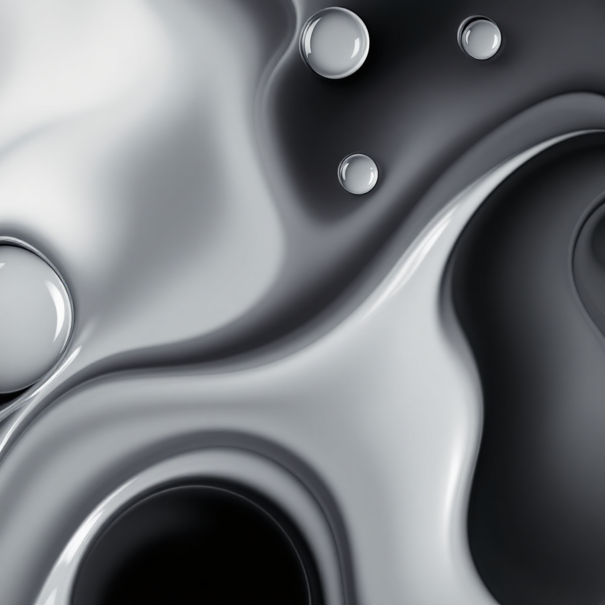

    Preview (Versão Web)

    <a href="https://gamma.app/docs/Guia-Pratico-Aplicando-o-Efeito-Liquid-Glass-Glassmorphism-7h864f4ye3krue3" target="_blank">
      <strong>Clique aqui para ver a versão web no Gamma</strong>
    </a>

# Projeto E-book "Aplicando o Liquid Glass" Gerado por I.A.

> ℹ️ **NOTA:** Este repositório documenta o processo de criação de um e-book sobre Glassmorphism (Liquid Glass) utilizando um fluxo de trabalho baseado em IA.

Projeto com o objetivo de gerar um e-book completo (capa, capítulos e exemplos de código) utilizando ferramentas de IA para a geração de conteúdo, arte e design final.

## 💻 Tecnologias utilizadas no projeto

- [**Gemini (Google)**](https://gemini.google.com/) - Para geração do roteiro (capítulos), exemplos de código e arte da capa.
- [**Gamma**](https://gamma.app/) - Para montagem final e hospedagem da versão web do e-book.
- **Edição Manual (Maikon Silva)** - Para revisão, curadoria e ajustes finos do conteúdo.

## ✨ Como foi feito ?

- **Roteiro e Conteúdo** (texto e código) gerados via Gemini.
- **Arte da Capa** gerada pelo Gemini.
- **Montagem e Design** da versão web feita no Gamma.
- **PDF Final** gerado a partir do conteúdo e exportado do Gamma.

## 📚 Arquivos do Projeto

- **[Prompt](./input/prompt.txt)**: O prompt mestre utilizado para gerar o conteúdo no Gemini.
- **[E-book Final (PDF)](./output/Ebook%20completo.pdf)**: O e-book compilado e finalizado (PDF).
- **[Capa](./src/logo.png)**: A arte da capa gerada pelo Gemini.
- **[Versão Web](https://gamma.app/docs/Guia-Pratico-Aplicando-o-Efeito-Liquid-Glass-Glassmorphism-7h864f4ye3krue3)**: Link para a versão online hospedada no Gamma.

## 🤖 Roteirista e Artista (IA)

    
    
&nbsp&nbsp&nbsp;Gemini 
    &nbsp&nbsp&nbsp
    <a 
        href="https://gemini.google.com/">
        Site Oficial
    </a>
    &nbsp;|&nbsp;
    <a 
        href="https://blog.google/technology/ai/google-gemini-ai/">
        Sobre
    </a>
    &nbsp;|&nbsp;

  

## 👌 Expert

    
    
&nbsp;&nbsp;&nbsp;⌨️ Feito com 💜 por <a href="https://www.linkedin.com/in/maikon-silva-457b98181/">Maikon Silva</a> & <a href="https://gemini.google.com/">Gemini</a> 
    &nbsp; 
    

  

